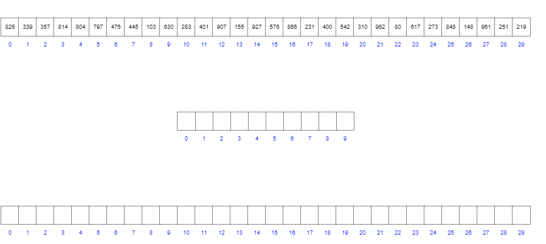

<h1 align="center">
  <bold>Radix Sort</bold>
</h1>

<h3 align="center"> 📄 🚀 </h3>

<br/>

<p align="center">
  

  

  

  

  
</p>

<br/>
<hr/>
<br/>

<p>O Radix Sort é um algoritmo de ordenação que não utiliza comparação, isto é, por meio da contagem de elementos ele consegue obter o índice dos elementos por meio da ordenação pelo dígito único, ou seja, ele pega o valor em dígitos únicos e ordena começando do dígito menos significativo até chegar no dígito mais significativo. A contagem é feita pelo algoritmo Counting Sort como uma sub-rotina. O Counting sort pega o dígito do valor e adiciona uma contagem em um array de tamanho 10. Feito isso, o Counting Sort soma o valor do array de contagem mais o valor do índice atual menos 1. Então, o Counting Sort faz uma relação entre o valor a ser ordenado no array não ordenado, o valor da contagem, o índice da contagem e o índice do novo array. Ou seja, ele pega índice do dígito selecionado e adiciona o valor do dígito selecionado no índice do novo array com o valor de contagem como índice.</p>

<br/>
<hr/>

#### [Radix em Java](https://github.com/rwietter/radixsort/tree/master/src)
#### [Radix em JavaScrit](https://github.com/rwietter/radixsort/tree/master/javascript)
#### [Radix em TypeScript](https://github.com/rwietter/radixsort/tree/master/typescript)

<hr/>

<br/>

<p align="center">
  
</p>

[Animação USFCA](https://www.cs.usfca.edu/~galles/visualization/RadixSort.html)


<br/>
<br/>
<hr/>

<h3> ☑️ Como utilizar </h3>

Instale o [Git](https://git-scm.com/downloads), o [Visual Studio Code](https://code.visualstudio.com/), o [NodeJS^12.16.1 ou superior](https://nodejs.org/en/), o [Yarn^1.22.4](https://yarnpkg.com/) e o [Deno^1.0.0 ou superior](https://deno.land/)

```shell
# Clone este repositório
git clone https://github.com/rwietter/radixsort.git

# Entre no diretório
cd radixsort

# Instale as dependências
yarn install

# Inicie com JavaScrit
node .\javascript\app.js

# Inicie com TypeScript
deno run .\typescript\App.ts

# Testes unitários
yarn test

```

<hr/>

### 🌐 Como contribuir
- Faça um fork deste repositório;
- Crie uma branch com a sua feature: `git checkout -b my-feature`
- Faça um commit das suas mudanças: `git commit -m 'feat: My new feature'`
- De push na sua branch: `git push origin my-feature`

<hr/>

### 📝 Licença

Esse projeto está sob a licença MIT. Veja o arquivo [LICENSE](LICENSE) para mais detalhes.

<hr/>

<p align="center">
  <bold>Feito por @rwietter</bold>
</p>
